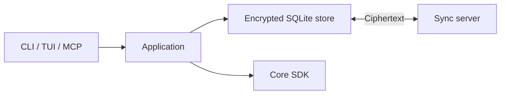

# Respire CLI

Local-first memory for AI tools, with encrypted storage, synchronization, a terminal interface and an authenticated HTTP/MCP runtime. The command is `rsrs`.



## Build

Use the pinned Rust toolchain and a Core SDK matching your target and `sdk/core-sdk.lock.json`.

```sh
export RESPIRE_CORE_SDK_DIR=/path/to/sdk
node scripts/fetch-core-sdk.mjs <rust-target>
cargo build --locked --release -p respire --bins
node scripts/stage-core-runtime.mjs target/release
```

On PowerShell, set `$env:RESPIRE_CORE_SDK_DIR`. Include the staged runtime libraries and notices with the executable. See [SDK setup](crates/core-sdk/README.md) and [Linux builds](docs/linux-build.md).

## Usage

```sh
rsrs doctor
rsrs help
rsrs recall "query" --titles --json
```

The default profile is `~/.respire`, the local runtime port is `15169`, and the default sync API is `https://api.rsrs.rs`.

| Guide | Topic |
| --- | --- |
| [Runtime](docs/runtime.md) | Host lifecycle and sandbox clients |
| [Inference](docs/inference.md) | Model installation and engines |
| [Retrieval](docs/retrieval.md) | Retrieval modes and index migration |
| [npm launcher](npm/README.md) | Package layout and platform selection |
| [WorkBuddy connector](connectors/workbuddy/README.md) | Tool integration |
| [Command checks](docs/command-regression.md) | Existing validation commands |

## Test

```sh
export RESPIRE_CORE_TEST_MODE=1
cargo test --locked --workspace
```

Use isolated test data. `RESPIRE_CORE_TEST_MODE` selects existing test fixtures, not a production inference provider. Preserve protocol fields, user data formats and third-party notices. Do not commit credentials, databases, model files or build artifacts.
