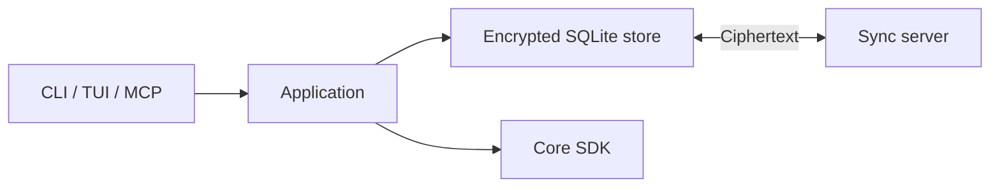

# Respire CLI

Local-first memory for AI tools, with encrypted storage, synchronization, a terminal interface and an HTTP/MCP runtime. Loopback access needs no token; non-loopback access requires authentication. The command is `rsrs`.



## Build

Use the pinned Rust toolchain and a Core SDK matching your target and `sdk/core-sdk.lock.json`.

```sh
export RSRS_CORE_SDK_DIR=/path/to/sdk
node scripts/fetch-core-sdk.mjs <rust-target>
cargo build --locked --release -p respire --bins
node scripts/stage-core-runtime.mjs target/release
```

On PowerShell, set `$env:RSRS_CORE_SDK_DIR`. Include the staged runtime libraries and notices with the executable. See [SDK setup](crates/core-sdk/README.md) and [Linux builds](docs/linux-build.md).

## Usage

```sh
rsrs doctor
rsrs help
rsrs web
rsrs recall "query" --titles --json
```

`rsrs web` opens https://dash.rsrs.rs without starting a local Web server. No dashboard assets are embedded in the CLI.

Commands display compact human-readable tables by default, without duplicate summaries, empty action columns or result footers. Use `--json` for the machine-readable result envelope and diagnostic details. During automatic BGE-M3 preparation, `rsrs doctor` shows the current file, download percentage, transferred MB and background index state; `rsrs doctor --json` retains the complete task and index objects in `details`.

Blocking human commands report progress on stderr while keeping stdout as the final table. `sync` and `doctor` report their current stage and what they are waiting for; model installation reports file and transfer progress. Interactive terminals update one status line, and redirected stderr receives plain lines on stage changes or every five seconds while waiting. Fast commands avoid progress chatter. `--json` disables human progress.

In the TUI model page, choose a preset or custom download mirror. Saving a source during a download offers cancellation and restart. You can also cancel a model task or restart from the selected source; the runtime waits for cancellation before starting the replacement. Verified model files and the original memory data/index are retained.

The default profile is `~/.rsrs`, the local runtime port is `15169`, and the default sync API is `https://api.rsrs.rs`.

Use `rsrs login --oauth` for browser authorization, or `rsrs login --interactive` to choose OAuth or password/TOTP. The TUI account login offers the same choices. Select GitHub in the dashboard when the server has enabled it; complete any TOTP challenge and approve CLI access, then enter your super password in the terminal. Authorization alone does not decrypt your memories. Cancelled or failed login preserves the original account.

For DEV acceptance, use `rsrs login --addr https://api.dev.rsrs.rs --oauth`. GitHub binding and unbinding are in the dashboard security page. Unbinding preserves the session; a GitHub-only account needs another login password before it can unlink GitHub. Production activation is separate from DEV delivery.

Startup preserves the selected account and does not import old profiles automatically. Use the TUI's Migrate old version action or `rsrs migrate` to choose a source and target account. Migration preserves encrypted data, settings and available credentials, keeps original directories intact and does not overwrite an existing account. Missing decryption credentials require the original recovery material.

`rsrs classify-config` reports classification configuration without invoking a model. Select a backend with `rsrs classify-config --set --backend jev` or `--backend ds --api-base <URL> --model <MODEL>`. Add `--key-stdin` to read a key from redirected input into the OS keyring; keys are never printed or stored in ordinary config files.

| Guide | Topic |
| --- | --- |
| [Runtime](docs/runtime.md) | Host lifecycle and sandbox clients |
| [Inference](docs/inference.md) | Model installation and engines |
| [Retrieval](docs/retrieval.md) | Retrieval modes and index migration |
| [npm launcher](npm/README.md) | Package layout and platform selection |
| [WorkBuddy connector](connectors/workbuddy/README.md) | Tool integration |
| [Command checks](docs/command-regression.md) | Existing validation commands |

## Test

```sh
export RSRS_CORE_TEST_MODE=1
cargo test --locked --workspace
```

Use isolated test data. `RSRS_CORE_TEST_MODE` selects existing test fixtures, not a production inference provider. Preserve protocol fields, user data formats and third-party notices. Do not commit credentials, databases, model files or build artifacts.

## License

First-party material uses the [Respire Noncommercial License 1.0](LICENSE).
Personal noncommercial use and self-hosting are permitted. Commercial use,
including internal business deployment, requires prior written authorization.
See [commercial licensing](COMMERCIAL-LICENSE.md).
