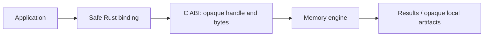

# Core SDK binding

Safe Rust caller for the Core static library. Consumers link a target-specific binary SDK through the C ABI.



| ABI operation | Responsibility |
| --- | --- |
| `rs_core_abi_version` | Report the ABI epoch |
| `rs_core_create` | Create a thread-confined opaque handle |
| `rs_core_call` | Execute a versioned business request |
| `rs_core_call_with_transport` | Execute using borrowed synchronous host transport callbacks |
| `rs_core_model_load` | Initialize inference from borrowed model and tokenizer bytes |
| `rs_core_model_load_with_host` | Initialize with a synchronous host native-options callback |
| `rs_core_register_providers` | Let the host register installed native providers |
| `rs_core_buffer_free` | Release Core-allocated output |
| `rs_core_destroy` | Release the handle |

Business calls prepare opaque index data, query memories, return maintenance
results and check model health. Local index references remain opaque. Errors stay
explicit. The binding owns buffer/handle cleanup, and handles cannot cross threads.

The public host adapter owns model discovery, file reads, engine configuration and
opaque artifact persistence. Core receives model/tokenizer buffers and explicit
configuration; it never receives paths, database names, account keys or environment
variables. The adapter preserves existing `rsi1:` locators and checks their SHA-256
before passing opaque contents into Core. Only Core interprets the index format.
Changing the persistence boundary does not change the quantized model's index
generation. Calls from additional threads reuse the resident model in memory.
Query and association settings contain only explicit host overrides. Core retains
the default policy and applies it when a setting is absent.

| Build check | Requirement |
| --- | --- |
| SDK location | `RSRS_CORE_SDK_DIR` |
| Integrity | Pinned manifest SHA-256 and individual file SHA-256 |
| Platform and Rust | Exact Cargo target, compiler release and commit |
| ABI | `0x00010002`, request schema `1` |
| Panic and CRT | `unwind`; dynamic MSVC CRT on Windows, static CRT on musl |
| Runtime | SDK libraries copied beside executable and test binaries |

`build.rs` validates the contract and links native libraries. This crate includes
its own SDK lock and preparation script; it does not depend on a CLI checkout.
With Node.js 22 or later, prepare an SDK from the crate directory:

```sh
node prepare-sdk.mjs x86_64-pc-windows-msvc /absolute/path/to/sdk
export RSRS_CORE_SDK_DIR=/absolute/path/to/sdk
cargo build
```

On PowerShell, set `$env:RSRS_CORE_SDK_DIR` instead of using `export`.
If a target has no download URL, supply an already prepared matching SDK at that
directory. The lock defines supported artifacts and download URLs. Flat release
assets are supported: `url` identifies a standalone manifest and
`archive_url` identifies an SDK `.tar.gz`, pinned by `archive_sha256`. Archives
must use ustar format and contain ordinary files/directories only. Downloads
are verified in a temporary directory before publishing the complete SDK at
the requested destination. Existing local SDKs are validated without download.
Consumers must package the manifest's `runtime/` libraries and `notices/` files alongside
the executable. The CLI provides `scripts/stage-core-runtime.mjs` for this step.
The wrapper license applies to the wrapper only; native SDK and model files
retain their separate distribution terms and notices.
On Windows, the host embeds Microsoft's pinned Windows ML 2.4.89 catalog. Its
full terms ship in `notices/WinML-2.4.89-license.txt`; the build checks them against
the SHA-256-verified NuGet package. CLI runtime staging also includes this notice
in `core-runtime.json`. Native catalog/provider paths never enter Core.

Association writes require `related_business` capability and association contract 1.
All supported targets use the matching pinned seven-platform SDK release. The
2.0 development Rust binding depends on the corresponding 2.0 development
protocol API; the C ABI remains 1. See [association compatibility](../../docs/associations.md).
