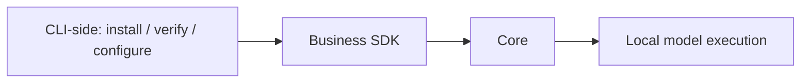

# Local inference

The Core executes ONNX models. CLI-side code manages downloads, checksums,
progress and engine settings.

| Engine | Platform | Requirement |
| --- | --- | --- |
| CPU | Windows, Apple Silicon, Linux | Default |
| GPU | Windows, Apple Silicon | Explicit selection and compatible hardware/model |
| NPU | Windows, Apple Silicon | Explicit selection and compatible provider/hardware/model |

Choose an engine in the TUI or run `rsrs model engine cpu|gpu|npu`.
`ONEMEMORY_ENGINE` overrides the saved selection. Automatic selection is unsupported.
Missing hardware and inference failures are reported without switching engines.
Provider names do not prove execution of every operation on the requested device.

| Command | Purpose |
| --- | --- |
| `model install` / `model install-m3` | Install or verify pinned BGE-M3 quantized (543 MiB model plus tokenizer) |
| `model uninstall` / `model uninstall-m3` | Delete user-installed M3 files |
| `model activate m3` / `reembed` | Rebuild/resume the M3 index |
| `model install-engines` | Explicit Windows provider installation |
| `model probe --json` | Actual M3 inference diagnostics |
| `model reset-cpu` | Host-only CPU runtime recovery |
| `restart --timeout 10` | Graceful restart; terminate the verified runtime after the deadline |

BGE-M3 uses `onnx/model_quantized.onnx` from `Xenova/bge-m3` revision
`4de13258303883538bd53b696b452bf8099f0858`: 569694530 bytes, SHA-256
`0826f8c1ab9edf1801db86c61919d4d108e8bfc0b809ec823ad366882ff0b77d`.
The tokenizer remains pinned to the same revision and checksum. FP16 and
`model_int8.onnx` cannot substitute for this file. This model has its own index
generation; old vectors are rebuilt using resumable checkpoints and the completed
generation is activated atomically. Subsequent restarts reuse this generation.

BGE-M3 is the sole embedding model (1024 dimensions, CLS pooling, L2 normalization). Legacy BGE
and cross-encoder rerank models cannot be installed, loaded or executed.
The TUI download-source editor offers auto, hf-mirror.com, hf-mirror.net and the
official Hugging Face origin, plus a custom URL. `--mirror` overrides
`ONEMEMORY_MIRROR`, then the persisted `model_mirror` setting; default is auto.
Explicit sources fail without switching; auto tries each source once. All
downloads retain the same pinned revision and SHA-256 checks. Files are staged
before replacement; cancellation preserves pinned-revision partial files for resume.
`ONEMEMORY_M3_DIR` overrides `~/.rsrs/models/bge-m3`. Old BGE directories and
`ONEMEMORY_MODEL_DIR` are not used. Model weights and engine selection are global;
switching accounts does not select another engine or model directory.

The runtime loads one shared native ONNX session and executes inference in process.
There is no inference child process or pipe protocol. Native calls execute on the
command/background threads; health and progress requests remain independent.
Admission uses a FIFO queue with at most 32 waiting requests and a 120-second
queue wait. A full queue rejects admission; an expired waiter is removed before
native execution. Native model loading and inference each have a 120-second
deadline. The former 15-second pipe-response timeout no longer applies.
Deadline expiry requests cooperative native cancellation and rejects late results.
It cannot guarantee that every provider releases a stuck native call. If a provider
ignores cancellation, the host must use `rsrs restart --timeout 10` to recover the
runtime; its verified process is terminated when graceful shutdown times out.
Native execution errors retain their underlying cause and do not switch engines
or permanently disable an engine after one failed call. Host recovery stops the
runtime when native execution is stuck. Recovery does not delete models or memories. Sandboxes cannot take over
runtime lifecycle. Models retain upstream cards, licenses and source information;
SDK runtime bundles carry native and model notices. ONNX Runtime's license does not
replace model-weight licenses. See [notice sources](model-notices/sources.json).

| Validation | Limit |
| --- | --- |
| Local SDK | Windows x64 checked |
| Other targets | Require native SDK validation and pinned artifacts |
| Hosted CPU workflow | Existing check, not proof of local cross-platform completion |
| GPU/NPU workflow | Manual real-hardware validation; no blanket vendor support claim |
