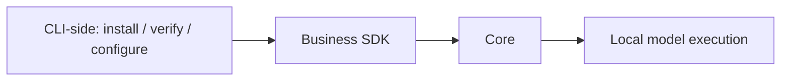

# Local inference

The Core executes ONNX models. CLI-side code manages downloads, checksums,
progress and engine settings.

| Engine | Platform | Requirement |
| --- | --- | --- |
| CPU | Windows, Apple Silicon, Linux | Default |
| GPU | Windows, Apple Silicon | Explicit selection and compatible hardware/model |
| NPU | Windows, Apple Silicon | Explicit selection and compatible provider/hardware/model |

Choose an engine in the TUI or run `rsrs model engine cpu|gpu|npu`.
`ONEMEMORY_ENGINE` overrides the saved selection. Automatic selection is unsupported.
Missing hardware and inference failures are reported without switching engines.
Provider names do not prove execution of every operation on the requested device.

| Command | Purpose |
| --- | --- |
| `model install-bge` | Pinned legacy BGE artifact |
| `model install-m3` | Install M3 without activation |
| `model install-rerank` | Optional reranker |
| `model install-engines` | Explicit Windows provider installation |
| `model probe --json` | Actual inference diagnostics |
| `model reset-cpu` | Host-only CPU runtime recovery |

The supervised worker shares local model execution. Health requests remain independent
of inference. Recovery does not delete models or memories. Sandboxes cannot take over
runtime lifecycle. Models retain upstream cards, licenses and source information;
SDK runtime bundles carry native and model notices. ONNX Runtime's license does not
replace model-weight licenses. See [notice sources](model-notices/sources.json).

| Validation | Limit |
| --- | --- |
| Local SDK | Windows x64 checked |
| Other targets | Require native SDK validation and pinned artifacts |
| Hosted CPU workflow | Existing check, not proof of local cross-platform completion |
| GPU/NPU workflow | Manual real-hardware validation; no blanket vendor support claim |
