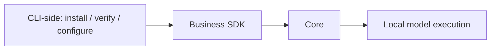

# Local inference

The Core executes ONNX models. CLI-side code manages downloads, checksums,
progress and engine settings.

| Engine | Platform | Requirement |
| --- | --- | --- |
| CPU | Windows, Apple Silicon, Linux | Default |
| GPU | Windows, Apple Silicon | Explicit selection and compatible hardware/model |
| NPU | Windows, Apple Silicon | Explicit selection and compatible provider/hardware/model |

Choose an engine in the TUI or run `rsrs model engine cpu|gpu|npu`.
`ONEMEMORY_ENGINE` overrides the saved selection. Automatic selection is unsupported.
Missing hardware and inference failures are reported without switching engines.
Provider names do not prove execution of every operation on the requested device.

| Command | Purpose |
| --- | --- |
| `model install` / `model install-m3` | Install or verify pinned BGE-M3 FP16 (~1.15GB) |
| `model uninstall` / `model uninstall-m3` | Delete user-installed M3 files |
| `model activate m3` / `reembed` | Rebuild/resume the M3 index |
| `model install-engines` | Explicit Windows provider installation |
| `model probe --json` | Actual M3 inference diagnostics |
| `model reset-cpu` | Host-only CPU runtime recovery |

BGE-M3 is the sole embedding model (1024 dimensions, CLS pooling). Legacy BGE
and cross-encoder rerank models cannot be installed, loaded or executed.
The TUI download-source editor offers auto, hf-mirror.com, hf-mirror.net and the
official Hugging Face origin, plus a custom URL. `--mirror` overrides
`ONEMEMORY_MIRROR`, then the persisted `model_mirror` setting; default is auto.
Explicit sources fail without switching; auto tries each source once. All
downloads retain the same pinned revision and SHA-256 checks. Files are staged
before replacement; cancellation cleans temporary files.
`ONEMEMORY_M3_DIR` overrides `~/.rsrs/models/bge-m3`. Old BGE directories and
`ONEMEMORY_MODEL_DIR` are not used. Loading has a 120-second deadline; inference
retains its 15-second deadline.

The supervised worker shares local model execution. Health requests remain independent
of inference. Recovery does not delete models or memories. Sandboxes cannot take over
runtime lifecycle. Models retain upstream cards, licenses and source information;
SDK runtime bundles carry native and model notices. ONNX Runtime's license does not
replace model-weight licenses. See [notice sources](model-notices/sources.json).

| Validation | Limit |
| --- | --- |
| Local SDK | Windows x64 checked |
| Other targets | Require native SDK validation and pinned artifacts |
| Hosted CPU workflow | Existing check, not proof of local cross-platform completion |
| GPU/NPU workflow | Manual real-hardware validation; no blanket vendor support claim |
