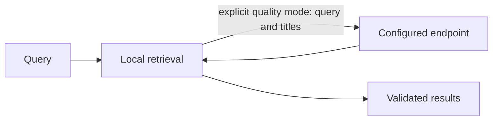

# Retrieval and local index migration

Core owns retrieval, ranking, feature preparation and context selection. CLI-side code
manages user settings, encrypted data and local index locators.

## Research routing and ablation

The Core applies the research query routing by default: recency is enabled only
for temporal queries, and the tree contribution is scaled to one quarter.
`RSRS_ROUTE=0` restores the previous always-on scoring. `RSRS_ABLATE` accepts
comma-separated `semantic`, `kw`, `recency`, `hot`, `emo`, and `tree`; named axes
are zeroed without renormalization. The host reads the variables and supplies
explicit controls to the memory-only Core. `ONEMEMORY_ROUTE` and
`ONEMEMORY_ABLATE` remain supported compatibility names.

Every recall JSON summary, including empty results and quality-selection failures,
contains `routing` with `temporal`, `route_on`, and normalized `ablate` from the
actual Core call. Benchmark parameter snapshots include both controls. Environment
changes apply to the executing process; a running runtime must receive its controls
in its own environment. Changing a thin client's environment does not change it.

Candidate receipts append five numbered judgments: duplicate, contradiction,
obsolete, linkable, and representation. The same actions are included in pending
remember receipts. Consumers answer each question before choosing update, merge,
parent, or force; a candidate receipt is not a successful write.

Both plaintext record and encrypted-payload parsing accept historical string and
array `see_also` values. Serialization writes arrays only, omitting empty lists.

The current Core uses a zero-valued emotion contribution; `emo` ablation therefore
does not change scores. This control does not add an emotion signal to the index.

For local ablation measurements, set `RSRS_DATA_DIR` to an initialized isolated
library copy, with its session and opaque index artifacts. Copy SQLite WAL state
consistently with the database. The example opens SQLite read-only, does not migrate,
does not prepare missing indexes, and does not update recall counts or query logs.
Fast mode performs no selector request. Optional report files contain memory titles
and must stay in a suitable local output directory.

```powershell
$env:RSRS_DATA_DIR = 'D:\isolated-library'
$env:RSRS_ROUTE = '0' # baseline; remove this variable for research routing
$env:RSRS_ABLATE = 'recency,tree' # empty value enables all axes
cargo run --locked -p respire --example ablation_bench -- daily_evalset.jsonl --topk 5 --per-case --save baseline.json
```

`--per-case` writes one case and its actual routing receipt per stdout line, with
aggregate metrics on stderr. `--save` uses the existing benchmark report format,
including the environment-control snapshot. Both canonical `RSRS_*` names and
historical `ONEMEMORY_*` aliases use the same host resolution as normal retrieval.



| Mode | Data flow |
| --- | --- |
| Fast, default | Local retrieval, no selector request |
| High quality | Query and bounded candidate titles sent to the configured endpoint |
| Selector failure | Local results with fallback diagnostics |

Memory and ancestor bodies are not sent to the selector. The TUI explains this flow;
high quality requires the user's explicit choice.

```sh
rsrs recall "query" --mode fast --titles --json
rsrs recall "query" --mode quality --titles --json
rsrs agent-config --set recall_mode=fast
```

Configure URL/model/key on the Models page. Keys use the OS keyring, not `agent.json`.
`RSRS_RECALL_API_KEY` overrides the running process key. File settings apply on the
next query; changed process environment requires runtime restart. TUI recall checks
use the same data flow and diagnostics.

| Migration step | Behavior |
| --- | --- |
| Runtime automatic preparation | Detect pending index work, prepare missing M3 files and rebuild in the background |
| `model install-m3` | Explicitly verify pinned files; pending index work is handled by the runtime |
| `model activate m3` | Rebuild/resume locally, then activate after source checks |
| Interrupted rebuild | Keep completed checkpoints; resume the M3 rebuild |
| Concurrent content edit | Reject stale derived data |
| Legacy index | Rebuild from decrypted source with M3; retired inference never runs |
| `reembed` | Repair missing/outdated data for the current model |

When a usable account has an invalid or incomplete index, the runtime prepares M3
and rebuilds derived data in the background. Retrieval reports `index_pending`
until the source-checked index is ready; no manual rebuild confirmation is needed.
The TUI displays progress and download errors through the model-operation channel.
Rebuilding checkpoints completed entries and resumes pending work after restart.
Encrypted memories, account keys and sync state are preserved. Explicit invalid
model paths or failed downloads remain visible errors.

`RSRS_M3_DIR` selects the model directory. Index work does not alter memory content
or synced dirty flags. Core artifacts are opaque, versioned local derived data, not
account keys or an encryption mechanism. Writes and changed sync inputs maintain the
active index; deleted content is excluded from retrieval.

`--titles --json` requests IDs, titles and final scores; `show <id> --json` reads selected
memories. Binary updates do not rewrite agent files; run `rsrs inject` after prompt changes.

New profiles use M3. Existing legacy metadata does not select the retired model.
Incomplete M3 generations remain resumable; semantic retrieval requires a complete
source-checked M3 index. The runtime continues long migrations in the background;
`rsrs reembed` remains available for an explicit repair. Existing M3
artifacts retain their generation identity. Content, timestamps and sync flags
are unchanged; retired weight files are not deleted automatically.

Recall associations are documented in [associations](associations.md). Use `--no-related` for a per-request original-results comparison.
