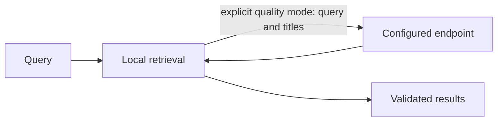
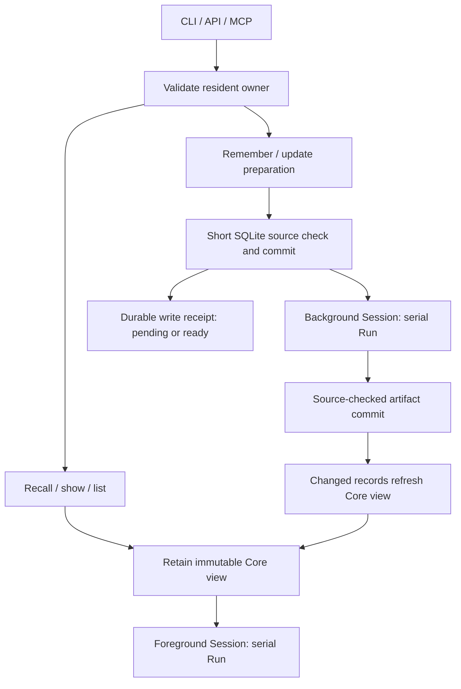

# Retrieval and local index migration

Core owns retrieval, ranking, feature preparation and context selection. CLI-side code
manages user settings, encrypted data and local index locators.

## Research routing and ablation

The Core applies the research query routing by default: recency is enabled only
for temporal queries, and the tree contribution is scaled to one quarter.
`RSRS_ROUTE=0` restores the previous always-on scoring. `RSRS_ABLATE` accepts
comma-separated `semantic`, `kw`, `recency`, `hot`, `emo`, and `tree`; named axes
are zeroed without renormalization. The host reads the variables and supplies
explicit controls to the memory-only Core. `ONEMEMORY_ROUTE` and
`ONEMEMORY_ABLATE` remain supported compatibility names.

Every recall JSON summary, including empty results and quality-selection failures,
contains `routing` with `temporal`, `route_on`, and normalized `ablate` from the
actual Core call. Benchmark parameter snapshots include both controls. Environment
changes apply to the executing process; a running runtime must receive its controls
in its own environment. Changing a thin client's environment does not change it.

Candidate receipts append five numbered judgments: duplicate, contradiction,
obsolete, linkable, and representation. The same actions are included in pending
remember receipts. Consumers answer each question before choosing update, merge,
parent, or force; a candidate receipt is not a successful write.

Both plaintext record and encrypted-payload parsing accept historical string and
array `see_also` values. Serialization writes arrays only, omitting empty lists.

The current Core uses a zero-valued emotion contribution; `emo` ablation therefore
does not change scores. This control does not add an emotion signal to the index.

For local ablation measurements, set `RSRS_DATA_DIR` to an initialized isolated
library copy, with its session and opaque index artifacts. Copy SQLite WAL state
consistently with the database. The example opens SQLite read-only, does not migrate,
does not prepare missing indexes, and does not update recall counts or query logs.
Fast mode performs no selector request. Optional report files contain memory titles
and must stay in a suitable local output directory.

```powershell
$env:RSRS_DATA_DIR = 'D:\isolated-library'
$env:RSRS_ROUTE = '0' # baseline; remove this variable for research routing
$env:RSRS_ABLATE = 'recency,tree' # empty value enables all axes
cargo run --locked -p respire --example ablation_bench -- daily_evalset.jsonl --topk 5 --per-case --save baseline.json
```

`--per-case` writes one case and its actual routing receipt per stdout line, with
aggregate metrics on stderr. `--save` uses the existing benchmark report format,
including the environment-control snapshot. Both canonical `RSRS_*` names and
historical `ONEMEMORY_*` aliases use the same host resolution as normal retrieval.



| Mode | Data flow |
| --- | --- |
| Fast, default | Local retrieval, no selector request |
| High quality | Query and bounded candidate titles sent to the configured endpoint |
| Selector failure | Local results with fallback diagnostics |

Memory and ancestor bodies are not sent to the selector. The TUI explains this flow;
high quality requires the user's explicit choice.

```sh
rsrs recall "query" --mode fast --titles --json
rsrs recall "query" --mode quality --titles --json
rsrs agent-config --set recall_mode=fast
```

Configure URL/model/key on the Models page. Keys use the OS keyring, not `agent.json`.
`RSRS_RECALL_API_KEY` overrides the running process key. File settings apply on the
next query; changed process environment requires runtime restart. TUI recall checks
use the same data flow and diagnostics.

| Migration step | Behavior |
| --- | --- |
| Runtime automatic preparation | Detect pending index work, prepare missing M3 files and rebuild in the background |
| `model install-m3` | Explicitly verify pinned files; pending index work is handled by the runtime |
| `model activate m3` | Rebuild/resume locally, then activate after source checks |
| Interrupted rebuild | Keep completed checkpoints; resume the M3 rebuild |
| Concurrent content edit | Reject stale derived data |
| Legacy index | Rebuild from decrypted source with M3; retired inference never runs |
| `reembed` | Repair missing/outdated data for the current model |

When a usable account has an invalid or incomplete index, the runtime prepares M3
and rebuilds derived data in the background. Recall uses current, source-checked
index artifacts and full-body lexical retrieval for pending entries. A library
with no indexed entries can perform lexical retrieval without loading the model.
Its JSON summary reports `index_pending`, `indexed_candidates` and
`lexical_candidates`; pending entries gain semantic retrieval after background
indexing completes. No manual rebuild confirmation is needed.
The TUI displays progress and download errors through the model-operation channel.
Rebuilding checkpoints completed entries and resumes pending work after restart.
Encrypted memories, account keys and sync state are preserved. Explicit invalid
model paths or failed downloads remain visible errors.

`RSRS_M3_DIR` selects the model directory. Index work does not alter memory content
or synced dirty flags. Core artifacts are opaque, versioned local derived data, not
account keys or an encryption mechanism. Writes and changed sync inputs maintain the
active index; deleted content is excluded from retrieval.

`--titles --json` requests IDs, titles and final scores; `show <id> --json` reads selected
memories. Binary updates do not rewrite agent files; run `rsrs inject` after prompt changes.

New profiles use M3. Existing legacy metadata does not select the retired model.
Incomplete M3 generations remain resumable; semantic retrieval uses only valid,
source-checked M3 artifacts. The runtime continues long migrations in the background;
`rsrs reembed` remains available for an explicit repair. Existing M3
artifacts retain their generation identity. Content, timestamps and sync flags
are unchanged; retired weight files are not deleted automatically.

## Resident retrieval and concurrency

The runtime keeps one foreground and one background ONNX session. Each session
runs one inference call at a time; the two sessions have independent admission
queues. Foreground query embedding does not wait for a background indexing batch.
The tokenizer and immutable model input bytes are shared; native session weights
and work buffers may be allocated separately.

Explicit lexical-only requests use a per-request vector-free metadata copy,
including mixed indexed/pending data; the resident vectors remain unchanged.

Core holds an immutable parsed retrieval view. Unchanged queries retain that view;
source/artifact revisions publish an incremental replacement. Existing readers
retain their previous view until their query ends. An account/key change invalidates
the host cache and old-context replies. Refreshes decrypt changed records outside
the cache publication lock. Publication still copies unchanged Core view data once
per refresh; it is not a zero-copy persistent tree.

Normal runtime remember/update prepare outside the SQLite write transaction.
Only the commit phase takes the host write gate to coordinate with account changes
and complex edits. The short SQLite transaction validates the source ciphertext, commits the source and
local artifact state, and rejects a concurrent conflicting preparation. One
source conflict is re-evaluated from the latest record. The write receipt reports
`index_state` as pending or ready; successful durable storage does not wait for
background embeddings. Background artifact publication also checks the source
ciphertext, so concurrent edits cannot receive an obsolete artifact. Complex
multi-record operations retain the existing exclusive host gate.

The runtime follows the operating system's available CPU parallelism for ordinary jobs and reserves two additional show/list/status
slots. Reads use WAL snapshots without an application writer gate. Healthy host
clients reuse the validated runtime before taking the lifecycle gate; only startup,
replacement and recovery serialize through that gate. SQLite still permits one writer.
Health and CLI progress report foreground/background activity and queues separately.

`RSRS_RPC_PARALLELISM` or `config --rpc-parallelism` may reduce ordinary concurrency;
values above available CPU parallelism are clamped. `/api/health` reports both
`rpc.available_parallelism` and `rpc.effective_parallelism`. This does not create
additional model sessions: foreground and background inference each remain serial.

Queued HTTP and pipe commands await their result in asynchronous connection
tasks. Completion callbacks only hand off in-memory results; neither command
workers nor the dispatcher write sockets or wait for preceding HTTP responses.
Incomplete bodies and stalled writes have transport deadlines independent of
command execution. Ordinary queue length does
not reject a command. Execution slots still follow available CPUs; model sessions
and serialized write transactions remain unchanged.
`RSRS_RPC_QUEUE_WAIT_SECS` bounds queue waiting (default 120, range 1–3600).
RPC callers can shorten this wait using the optional `queue_wait_ms` field.
Expired commands that have not started are removed and cannot later commit a write.
Once execution starts, the server keeps its actual result; a queue deadline is
not reported as cancellation of an executing write. The HTTP client's existing
120-second deadline can still precede that result. Such transport failures return
`request_outcome_unknown` with the original request ID, and never replay the write.
Inspect it with an RPC request such as
`{"v":1,"id":"inspection-id","method":"runtime.result","args":["original-request-id"]}`.
`pending` means the request is queued or executing; `completed` includes its
original response. `unknown` is not proof that the write did not commit: receipts
cover the last 64 completed requests in the current runtime and do not survive
restart. Concurrent reuse of an in-flight request ID is rejected rather than
executed again; this is not durable exactly-once execution.
Health and stop HTTP endpoints remain outside ordinary command admission.
Manual sync captures its outgoing boundary in the existing sync worker under the
write gate, with a generation check; waiting for this snapshot never occupies the
shared dispatcher or a network executor. An expired sync cannot execute when the
gate later becomes available.
The health response includes the last
1024 queue/command timing samples in microseconds; command time ends at the
in-memory result handoff and excludes asynchronous socket delivery. It does not
separately measure native inference or storage.

The resident host holds the LibraryLock and owns SQLite commits. It sends Core
business requests over private inherited pipes to one shared worker process;
the worker reuses the foreground and background native sessions. Transport
credentials remain in host callbacks, and the child receives only OS loader
paths and local inference settings. It opens no network listener or memory
database. `--client-only` and `--no-autostart` do not own or recover workers.

The host observes native watchdog status independently of command execution.
If a cancelled native call remains unresponsive for five more seconds, or worker
heartbeats stop for ten seconds, it fails pending Core calls without replay,
terminates the owned child and confirms exit before permitting a replacement.
Each complete Core call also has a 365-second ceiling, covering the existing
load, native queue and execution budgets plus grace, even when an abnormal call
never reaches Run. Running SQLite writes remain owned by the host and return
their actual commit result.
The next request rebuilds its authorized resident view from the host store and
loads the model once in the replacement process. Old generation replies and
leases cannot be used by the replacement. The native execution watchdog retains
its SDK timeout; this is recovery after cancellation, not a faster native model.
If termination cannot be confirmed, replacement is prohibited; health/control
remain available and the host retains its library lock during shutdown.

`native-fault-tests` is a non-default fixture feature. Its explicitly marked SDK
can inject holds at the real Run boundary with a two-second watchdog. The fixture
also shortens the complete Core call ceiling to ten seconds. SDK promotion,
release staging and the exact binary version gate reject fixture
packages. Fault injection validates containment and recovery; it does not prove
that a real ORT call has the same defect.



Recall associations are documented in [associations](associations.md). Use `--no-related` for a per-request original-results comparison.
