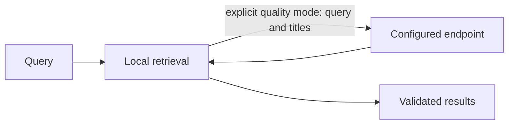

# Retrieval and local index migration

Core owns retrieval, ranking, feature preparation and context selection. CLI-side code
manages user settings, encrypted data and local index locators.



| Mode | Data flow |
| --- | --- |
| Fast, default | Local retrieval, no selector request |
| High quality | Query and bounded candidate titles sent to the configured endpoint |
| Selector failure | Local results with fallback diagnostics |

Memory and ancestor bodies are not sent to the selector. The TUI explains this flow;
high quality requires the user's explicit choice.

```sh
rsrs recall "query" --mode fast --titles --json
rsrs recall "query" --mode quality --titles --json
rsrs agent-config --set recall_mode=fast
```

Configure URL/model/key on the Models page. Keys use the OS keyring, not `agent.json`.
`ONEMEMORY_RECALL_API_KEY` overrides the running process key. File settings apply on the
next query; changed process environment requires runtime restart. TUI recall checks
use the same data flow and diagnostics.

| Migration step | Behavior |
| --- | --- |
| `model install-m3` | Verify pinned files; retain the active model/index |
| `model activate m3` | Rebuild/resume locally, then activate after source checks |
| Interrupted rebuild | Keep checkpoints and active index |
| Concurrent content edit | Reject stale derived data |
| `model activate legacy` | Rebuild/resume the retained legacy index |
| `reembed` | Repair missing/outdated data for the current model |

Automatic index repair has a 15-second foreground budget, checked between entries.
An in-flight model call retains its own timeout. If repair exceeds the budget,
the command asks you to run `rsrs reembed` explicitly. Rebuilding checkpoints each
completed entry and reports progress through the runtime model-operation channel.
Retrying resumes completed work; encrypted memories and account keys are preserved.

`ONEMEMORY_M3_DIR` selects the model directory. Index work does not alter memory content
or synced dirty flags. Core artifacts are opaque, versioned local derived data, not
account keys or an encryption mechanism. Writes and changed sync inputs maintain the
active index; deleted content is excluded from retrieval.

`--titles --json` requests IDs, titles and final scores; `show <id> --json` reads selected
memories. Binary updates do not rewrite agent files; run `rsrs inject` after prompt changes.
