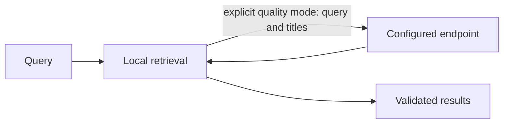

# Retrieval and local index migration

Core owns retrieval, ranking, feature preparation and context selection. CLI-side code
manages user settings, encrypted data and local index locators.



| Mode | Data flow |
| --- | --- |
| Fast, default | Local retrieval, no selector request |
| High quality | Query and bounded candidate titles sent to the configured endpoint |
| Selector failure | Local results with fallback diagnostics |

Memory and ancestor bodies are not sent to the selector. The TUI explains this flow;
high quality requires the user's explicit choice.

```sh
rsrs recall "query" --mode fast --titles --json
rsrs recall "query" --mode quality --titles --json
rsrs agent-config --set recall_mode=fast
```

Configure URL/model/key on the Models page. Keys use the OS keyring, not `agent.json`.
`RSRS_RECALL_API_KEY` overrides the running process key. File settings apply on the
next query; changed process environment requires runtime restart. TUI recall checks
use the same data flow and diagnostics.

| Migration step | Behavior |
| --- | --- |
| Runtime automatic preparation | Detect pending index work, prepare missing M3 files and rebuild in the background |
| `model install-m3` | Explicitly verify pinned files; pending index work is handled by the runtime |
| `model activate m3` | Rebuild/resume locally, then activate after source checks |
| Interrupted rebuild | Keep completed checkpoints; resume the M3 rebuild |
| Concurrent content edit | Reject stale derived data |
| Legacy index | Rebuild from decrypted source with M3; retired inference never runs |
| `reembed` | Repair missing/outdated data for the current model |

When a usable account has an invalid or incomplete index, the runtime prepares M3
and rebuilds derived data in the background. Retrieval reports `index_pending`
until the source-checked index is ready; no manual rebuild confirmation is needed.
The TUI displays progress and download errors through the model-operation channel.
Rebuilding checkpoints completed entries and resumes pending work after restart.
Encrypted memories, account keys and sync state are preserved. Explicit invalid
model paths or failed downloads remain visible errors.

`RSRS_M3_DIR` selects the model directory. Index work does not alter memory content
or synced dirty flags. Core artifacts are opaque, versioned local derived data, not
account keys or an encryption mechanism. Writes and changed sync inputs maintain the
active index; deleted content is excluded from retrieval.

`--titles --json` requests IDs, titles and final scores; `show <id> --json` reads selected
memories. Binary updates do not rewrite agent files; run `rsrs inject` after prompt changes.

New profiles use M3. Existing legacy metadata does not select the retired model.
Incomplete M3 generations remain resumable; semantic retrieval requires a complete
source-checked M3 index. The runtime continues long migrations in the background;
`rsrs reembed` remains available for an explicit repair. Existing M3
artifacts retain their generation identity. Content, timestamps and sync flags
are unchanged; retired weight files are not deleted automatically.

Recall associations are documented in [associations](associations.md). Use `--no-related` for a per-request original-results comparison.
