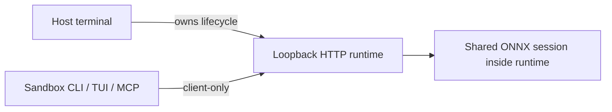

# Host runtime and sandbox clients



| Context | Behavior |
| --- | --- |
| Host | Starts, stops, updates and recovers the runtime |
| Sandbox | Connects to the host loopback runtime without a token |
| Restricted Windows token | Automatically selects client-only mode |
| Other sandboxes | Integration explicitly selects client-only mode |

```sh
# Hosted dashboard (does not start the local runtime)
rsrs web
# Host lifecycle diagnostics
rsrs --runtime-internal
rsrs --runtime-internal --stop
# Sandbox
rsrs --client-only recall "query" --titles --json
```

Client-only mode forbids lifecycle changes, binary copies, upgrades, CPU recovery and
`--direct` execution. MCP stdio does not copy the executable. A failed request never
triggers sandbox takeover. An idle runtime stays running until the host stops it.

`rsrs doctor` includes a `Runtime version` check. Its JSON summary exposes
`runtime_version`, which is `null` when no runtime is connected. The TUI home
and version pages show the connected runtime's version separately from the CLI
version. A disconnected TUI shows `Runtime not connected` instead of a cached
version. Reading this version does not start or replace a runtime.

Host `account <name>`, `account use <name>`, `space use <name>` and
`config --data-dir <path>` coordinate shutdown, profile selection and restart.
An invalid target keeps the original profile and restarts its service.
Client-only tools cannot switch the host profile. `--direct` still requires a
stopped runtime and does not perform an automatic takeover.

`space join` also runs on the host coordinator. Invalid invites and existing
targets are rejected before stopping the runtime. Joining creates the invited
profile and restarts the original selected profile; `space use <name>` switches
to the joined profile explicitly. Read-only joins and keyring warnings count as
successful joins. Failed server requests restore the original configuration and
runtime.

Human CLI requests use a hidden request ID and the additive `cli.progress` RPC
to read their current stage outside the worker queue. `--json` does not start a
human progress display. `model.prepare` schedules preparation from the selected
mirror on the existing background model worker; `model.control` cancels only the
matching active task. Cancellation must release its model slot before restart.

| Setting | Purpose |
| --- | --- |
| `RSRS_CLIENT_ONLY=1` | Host runtime client mode |
| `RSRS_NO_AUTOSTART=1` | Compatibility synonym |
| `RSRS_RPC_PORT` | Override the default port `15169` |

CLI / TUI / MCP stdio connect to `127.0.0.1` without reading a token file or
requiring token injection. Loopback listeners do not create a token. The runtime
currently rejects non-loopback bind addresses, so cross-machine runtime access
is not supported. Non-loopback peers are never exempt from authentication.
The server checks the actual peer address, not Host or forwarded headers.
Every request must use the bound loopback authority or `localhost` with the
bound port as its Host; when bound to HTTP port 80, Host may omit `:80`.
Origin checks apply to GET and POST alike. MCP endpoints
use the actual bound address.

Keep tokens out of prompts and reports. Remote containers do not automatically
share host loopback addresses.

| Error | Meaning | Action |
| --- | --- | --- |
| `runtime_unavailable` | Runtime unavailable | Host starts the service |
| `runtime_unauthorized` | Authentication rejected | Non-loopback client supplies a valid token; a loopback client requires an updated host runtime |
| `runtime_transport` | Connection failed | Host checks endpoint/network |

## Server deployment

| Service | Address |
| --- | --- |
| Main site | `https://rsrs.rs` |
| User dashboard | `https://dash.rsrs.rs` |
| Administration | `https://admin.rsrs.rs` |
| Default API | `https://api.rsrs.rs` |

The default API can be changed through the server settings. Respire uses `~/.rsrs` and port `15169`; startup preserves the selected account and does not import old profiles automatically. Use the TUI's Migrate old version action or `rsrs migrate` to select a source and target account. Original directories remain intact and existing accounts are not overwritten. Explicit
`ONEMEMORY_*` overrides remain supported, and the database filename and wire format
remain compatible.

## Hosted dashboard and local transport

`rsrs web` opens `https://dash.rsrs.rs`. `rsrs web --no-open --json` reports that URL without opening a browser. It does not start, stop, or bind the runtime. Former `web --host`, `--port`, `--status`, `--stop`, and `--internal` flags are no longer supported.

The hidden `--runtime-internal` entry is reserved for host lifecycle and automated diagnostics. Commands that require the runtime automatically start it when allowed; restricted clients only connect. Local `/api/health`, `/api/rpc`, `/api/runtime/stop`, `/mcp`, and `/sse` accept actual loopback peers without a token. Non-loopback peers are not exempt from token checks, and non-loopback listening is currently unsupported. Browser pages, static assets, `/api/invoke`, and `/api/task` are removed. The non-loopback authentication gate accepts tokens in headers, never dashboard URLs.

## Upgrading an older runtime

The host command `rsrs --runtime-internal --stop` supports runtimes that still
require a loopback token, including 1.0.9. The client sends the existing
`RSRS_RPC_TOKEN` or runtime token file on the initial request. It does not
create or replace credentials, and it never replays a failed request. Current
loopback runtimes ignore the header and also work without a token file.
Health checks and normal RPC use the same compatibility rule, so host upgrades
can gracefully stop the old runtime before starting the new executable.

Run lifecycle commands from the host terminal; client-only mode does not permit
shutdown. Client-only requests also preserve existing authentication headers.
A missing or rejected legacy token requires the old runtime's existing
authentication material, rather than bypassing authentication or killing an
unverified process. HTTP redirects are disabled for the local runtime client.

## Model downloads and account switches

Model weights and inference engine selection are global to the installation
root (`RSRS_DATA_DIR` for isolated installations); the selected account's
library directory does not select another engine or require another model copy.
Account switching must preserve the global configuration and reuse compatible,
complete M3 artifacts. Only missing, changed or corrupt artifacts need indexing.

Large ONNX downloads use at most four HTTP ranges when the source honors range
requests. Sources without range support use one connection. Pinned-revision
temporary files and segment checkpoints survive interruption and mirror changes;
completed files are published only after their SHA256 matches the pinned model.
Progressing downloads do not expire merely because 30 minutes elapsed. The
existing bounded network-read timeout still applies. Parallel connections do not
guarantee faster transfers when the server or network limits total bandwidth.
