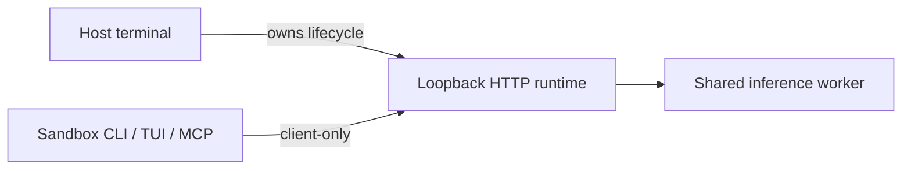

# Host runtime and sandbox clients



| Context | Behavior |
| --- | --- |
| Host | Starts, stops, updates and recovers the runtime |
| Sandbox | Connects to the host loopback runtime without a token |
| Restricted Windows token | Automatically selects client-only mode |
| Other sandboxes | Integration explicitly selects client-only mode |

```sh
# Hosted dashboard (does not start the local runtime)
rsrs web
# Host lifecycle diagnostics
rsrs --runtime-internal
rsrs --runtime-internal --stop
# Sandbox
rsrs --client-only recall "query" --titles --json
```

Client-only mode forbids lifecycle changes, binary copies, upgrades, CPU recovery and
`--direct` execution. MCP stdio does not copy the executable. A failed request never
triggers sandbox takeover. An idle runtime stays running until the host stops it.

Host `account <name>`, `account use <name>`, `space use <name>` and
`config --data-dir <path>` coordinate shutdown, profile selection and restart.
An invalid target keeps the original profile and restarts its service.
Client-only tools cannot switch the host profile. `--direct` still requires a
stopped runtime and does not perform an automatic takeover.

| Setting | Purpose |
| --- | --- |
| `ONEMEMORY_CLIENT_ONLY=1` | Host runtime client mode |
| `ONEMEMORY_NO_AUTOSTART=1` | Compatibility synonym |
| `ONEMEMORY_RPC_PORT` | Override the default port `15169` |

CLI / TUI / MCP stdio connect to `127.0.0.1` without reading a token file or
requiring token injection. Loopback listeners do not create a token. The runtime
currently rejects non-loopback bind addresses, so cross-machine runtime access
is not supported. Non-loopback peers are never exempt from authentication.
The server checks the actual peer address, not Host or forwarded headers.
Existing browser Origin checks still apply.

Keep tokens out of prompts and reports. Remote containers do not automatically
share host loopback addresses.

| Error | Meaning | Action |
| --- | --- | --- |
| `runtime_unavailable` | Runtime unavailable | Host starts the service |
| `runtime_unauthorized` | Authentication rejected | Non-loopback client supplies a valid token; a loopback client requires an updated host runtime |
| `runtime_transport` | Connection failed | Host checks endpoint/network |

## Server deployment

| Service | Address |
| --- | --- |
| Main site | `https://rsrs.rs` |
| User dashboard | `https://dash.rsrs.rs` |
| Administration | `https://admin.rsrs.rs` |
| Default API | `https://api.rsrs.rs` |

The default API can be changed through the server settings. Respire uses `~/.rsrs` and port `15169`; supported old default profiles are copied safely on startup while the original directories remain. Explicit
`ONEMEMORY_*` overrides remain supported, and the database filename and wire format
remain compatible.

## Hosted dashboard and local transport

`rsrs web` opens `https://dash.rsrs.rs`. `rsrs web --no-open --json` reports that URL without opening a browser. It does not start, stop, or bind the runtime. Former `web --host`, `--port`, `--status`, `--stop`, and `--internal` flags are no longer supported.

The hidden `--runtime-internal` entry is reserved for host lifecycle and automated diagnostics. CLI commands automatically start the authenticated runtime when allowed; restricted clients only connect. Local `/api/health`, `/api/rpc`, `/api/runtime/stop`, `/mcp`, and `/sse` remain authenticated. Browser pages, static assets, `/api/invoke`, and `/api/task` are removed. Authentication tokens are accepted in headers, never dashboard URLs.
