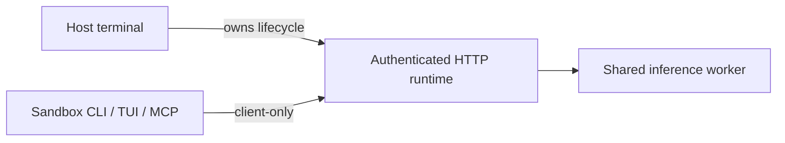

# Host runtime and sandbox clients



| Context | Behavior |
| --- | --- |
| Host | Starts, stops, updates and recovers the runtime |
| Sandbox | Connects to the authenticated runtime only |
| Restricted Windows token | Automatically selects client-only mode |
| Other sandboxes | Integration explicitly selects client-only mode |

```sh
# Host
rsrs web --no-open
rsrs web --stop
# Sandbox
rsrs --client-only recall "query" --titles --json
```

Client-only mode forbids lifecycle changes, binary copies, upgrades, CPU recovery and
`--direct` execution. MCP stdio does not copy the executable. A failed request never
triggers sandbox takeover. An idle runtime stays running until the host stops it.

| Setting | Purpose |
| --- | --- |
| `ONEMEMORY_CLIENT_ONLY=1` | Authenticated client mode |
| `ONEMEMORY_NO_AUTOSTART=1` | Compatibility synonym |
| `ONEMEMORY_RPC_PORT` | Override the default port `15169` |
| `ONEMEMORY_RPC_TOKEN` | Authentication token |
| Host `runtime/token` | Alternative token source with read access |

Keep tokens out of prompts and reports. Remote containers do not automatically share
host loopback addresses.

| Error | Meaning | Action |
| --- | --- | --- |
| `runtime_unavailable` | Runtime unavailable | Host starts the service |
| `runtime_token_missing` | No token | Integration supplies token/read access |
| `runtime_token_unreadable` | Cannot read token | Host repairs access |
| `runtime_unauthorized` | Authentication rejected | Host repairs authentication |
| `runtime_transport` | Connection failed | Host checks endpoint/network |

## Server deployment

| Service | Address |
| --- | --- |
| Main site | `https://rsrs.rs` |
| User dashboard | `https://dash.rsrs.rs` |
| Administration | `https://admin.rsrs.rs` |
| Default API | `https://api.rsrs.rs` |

The default API can be changed through the server settings. Respire uses its own `~/.respire` profile and port `15169`; it
does not automatically read the old product's config or session. Explicit
`ONEMEMORY_*` overrides remain supported, and the database filename and wire format
remain compatible.
